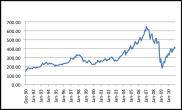
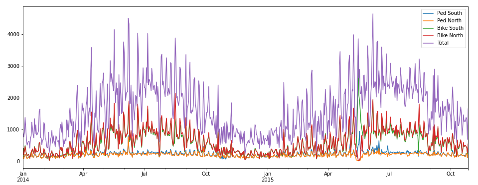
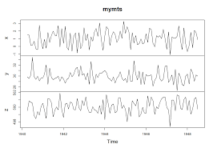

# Introduction

## What is time series data ?
   Time series data is data that is collected at different points of time unlike normal data that we find in most of the datasets which is measured at a single point of time ; time series data is collected at adjacent time periods and thus there is a possibility of correlation between the observations.This adds another dimensionality to data a <b>Time</b> dimension.This is one of the special features that distinguises time series data from normal data .Time series data is normally recorded at regular intervals(eg Hourly,Monthly ,Weekly etc) and this is the most common case known as  <b>Regular Time Series</b>.However this is not true all the time and sometimes time series data is recorded at irregular intervals and this is called <b>Irregular Time Series</b> we'll focus on regular time series for now.

   

   This is a plot of a stock price with X axis denoting the number of months and Y axis the price .

## Univariate Vs Multivariate Time Series 
  Time series in which one variable varies with time is called <b>Univariate</b> Time series data and the if multiple variables vary with time it is called <b>Multivariate</b> time series data . In the plot above we have univariate time series data . 

   

  The above plot represents Multivariate time series data;
  but there is a lot of difficulty to visualize data in such a manner thus we plot different graphs for each variable as u see in the image below

   
  
## Time Series Analysis and Forcasting
Time series analysis can be defined as trying to make sense of data. Time series analysis has existed since ancient times where we humans tracked the motion of planets .Time series analysis can also be defined as trying to extract useful inforamtion like trend anmd seasonality from the data like <b>trend</b> , <b>seasonality</b>, thjis can help companies decifer why we see drop in slaes during a certain period and so on.<b>Time series forcasting</b> is a part of time series analysis and falls under the category of predictive analysis getting future data fromn past values . 

## Some basic Charecteristics of Time Series Data 

### Trends
A trend is a gradual upward or downward shift in time series data or tendency of time series data to increase or decrease over time.

The above figure shows an upward trend in stock market data .
Trends may be <b>local</b> or <b>global</b> for example stock prices (decent ones atleast) show an increasing trend over their lifetime but may show a downward trend during recession or any other a=economic calamity.

### Seasonal Cycles

A seasonal cycle is a repetitive, predictable pattern in the series values.

Seasonal cycles are tied to the interval of your series. For instance, monthly data typically cycles over quarters and years. A monthly series might show a significant quarterly cycle with a low in the first quarter or a yearly cycle with a peak every December. Series that show a seasonal cycle are said to exhibit <b>seasonality</b>.

### Non Seasonal Cycles

A nonseasonal cycle is a repetitive, possibly unpredictable, pattern in the series values.

Some series, such as unemployment rate, clearly display cyclical behavior; however, the periodicity of the cycle varies over time, making it difficult to predict when a high or low will occur. Other series may have predictable cycles but do not neatly fit into the Gregorian calendar or have cycles longer than a year. For example, the tides follow the lunar calendar, international travel and trade related to the Olympics swell every four years, and there are many religious holidays whose Gregorian dates change from year to year.

Nonseasonal cyclical patterns are difficult to model and generally increase uncertainty in forecasting. The stock market, for example, provides numerous instances of series that have defied the efforts of forecasters. All the same, nonseasonal patterns must be accounted for when they exist. In many cases, you can still identify a model that fits the historical data reasonably well, which gives you the best chance to minimize uncertainty in forecasting.

### Pulses and Steps
Many series experience abrupt changes in level. They generally come in two types:

A sudden, temporary shift, or <b>pulse</b>, in the series level.
A sudden, permanent shift, or<b> step</b>, in the series level.

When steps or pulses are observed, it is important to find a plausible explanation. Time series models are designed to account for gradual, not sudden, change. As a result, they tend to underestimate pulses and be ruined by steps, which lead to poor model fits and uncertain forecasts. (Some instances of seasonality may appear to exhibit sudden changes in level, but the level is constant from one seasonal period to the next.)

If a disturbance can be explained, it can be modeled using an intervention or event. For example, during August 1973, an oil embargo imposed by the Organization of Petroleum Exporting Countries (OPEC) caused a drastic change in the inflation rate, which then returned to normal levels in the ensuing months. By specifying a point intervention for the month of the embargo, you can improve the fit of your model, thus indirectly improving your forecasts. For example, a retail store might find that sales were much higher than usual on the day all items were marked 50% off. By specifying the 50%-off promotion as a recurring event, you can improve the fit of your model and estimate the effect of repeating the promotion on future dates.

  

   
