# LSTMs 

Humans have the tendency to remeber things ; for example while reading a book we do not forget the contents of first page while reading the second page ,while watching movies we do not forget the past few minutes of the movie . This is not the case with neural networks though and normal ANNs do not show this property .Enter RNNS (Recurrent Neural Nets). 
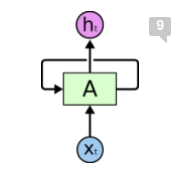

The above figure represents ba standard RNN . RNNs take output activation of the previous layer and the current input to give activations of current layer.This archiutecture makes a RNN look very intimidating .But we actually pass the activations and imput of current and previous layer through the same block.

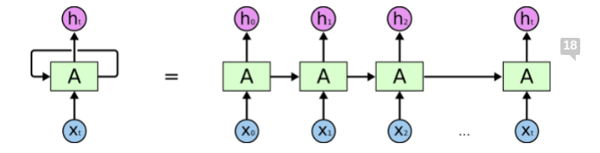

When we unroll the network we observe it looks like a standard neural network with somw modifications.LSTMs are built for sequential data here x1,x2..... xt are parts of the sequence.
So this architecture is especiallt used for sequence data.

## The problem of Remembering 

While RNNs are perfectly capable of remembering stuff they are pretty unsuccesful while remembewring long term dependencies.
For example if a RNN is used to complete the sentence(sequence) the birds are in the -----,here sky is the obvious answer and RNNs have no problem in predicting it but . He is in France ...............,he speaks__________,here the the network identifies the answer will be some language but cannot predict which one .
RNNs have difficulty in remembering long term dependencies like these.In 1997 we found an architecture for this problem .

## Enter LSTMs

LSTMs are a special type of RNN architecture and unlike RNNs their default behaviour is to remember(store) long teerm dependencies.

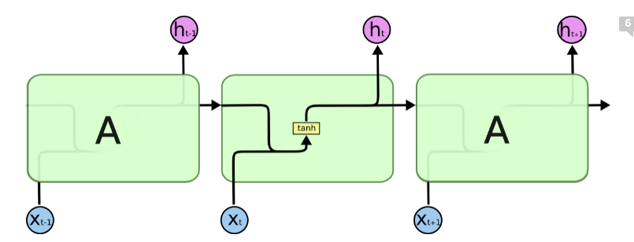

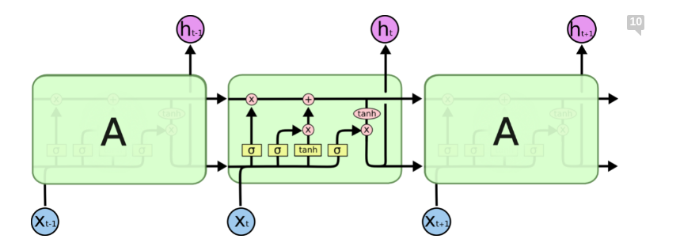

The above image shows a stacked RNN and LSTM network respectively
The LSTM block is similar to RNN block with a few additions .

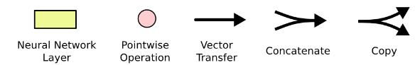

The above figure shows the notation of the of components used in the LSTM block.

## What makes LSTMs special ?

The key to LSTMs is the cell state, the horizontal line running through the top of the diagram.

The cell state is kind of like a conveyor belt. It runs straight down the entire chain, with only some minor linear interactions. It’s very easy for information to just flow along it unchanged.

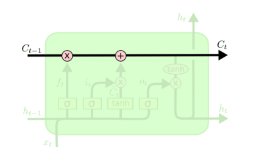

The LSTM does have the ability to remove or add information to the cell state, carefully regulated by structures called gates.

Gates are a way to optionally let information through. They are composed out of a sigmoid neural net layer and a pointwise multiplication operation.
The sigmoid function outputs values between 0 and 1 0 signifies "retain nothing" and 1 signifies "retain everything" .

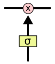

An LSTM block has 3 gates.

## The Mechanism

The first step in our LSTM is to decide what information we’re going to throw away from the cell state. This decision is made by a sigmoid layer called the “forget gate layer.” It looks at ht−1 and xt, and outputs a number between 0 and 1 for each number in the cell state Ct−1. A 1 represents “completely keep this” while a 0 represents “completely get rid of this.”

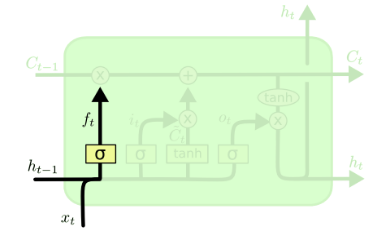

Suppose we have 2 or more subjects in a sentence(sequence) and we need to forget one subject when we encounter another.

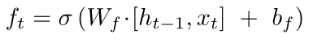

The next step is to decide what new information we’re going to store in the cell state. This has two parts. First, a sigmoid layer called the “input gate layer” decides which values we’ll update. Next, a tanh layer creates a vector of new candidate values, Ct, that could be added to the state. In the next step, we’ll combine these two to create an update to the state.

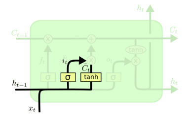

It’s now time to update the old cell state, Ct−1, into the new cell state Ct. The previous steps already decided what to do, we just need to actually do it.

It’s now time to update the old cell state, Ct−1, into the new cell state Ct. The previous steps already decided what to do, we just need to actually do it.

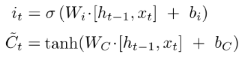

We multiply the old state by ft, forgetting the things we decided to forget earlier. Then we add it∗C~t. This is the new candidate values, scaled by how much we decided to update each state value.

In the case of the language model, this is where we’d actually drop the information about the old subject’s gender and add the new information, as we decided in the previous steps.

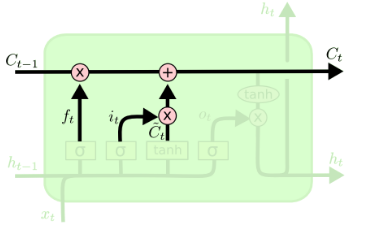

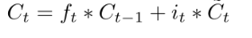

Finally, we need to decide what we’re going to output. This output will be based on our cell state, but will be a filtered version. First, we run a sigmoid layer which decides what parts of the cell state we’re going to output. Then, we put the cell state through tanh (to push the values to be between −1 and 1) and multiply it by the output of the sigmoid gate, so that we only output the parts we decided to.

For the language model example, since it just saw a subject, it might want to output information relevant to a verb, in case that’s what is coming next. For example, it might output whether the subject is singular or plural, so that we know what form a verb should be conjugated into if that’s what follows next.

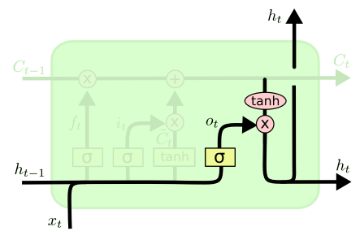

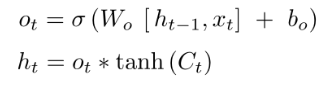
